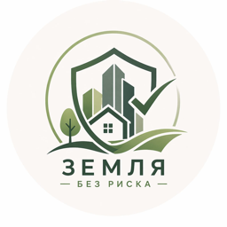

# Земля без риска check

Сервис проверки земельных участков по кадастровому номеру, адресу, координатам или точке на карте. Помогает до сделки быстро собрать базовые характеристики участка, ограничения и ориентир рыночной цены.

## Для кого

- покупателям и инвесторам в землю;
- риелторам и земельным брокерам;
- собственникам, которым нужен понятный материал для проверки или продажи участка.

## Что получает пользователь

- адрес, площадь, категорию земель и вид разрешённого использования;
- сведения об ограничениях и доступный контекст по объекту;
- ориентир рыночной цены по сопоставимым предложениям;
- расширенный экспертный PDF-отчёт: инфраструктура, коммуникации, ПЗЗ и структурированное описание рисков.

Проверку можно заказать в веб-интерфейсе или Telegram. Номер подготовленного отчёта можно передать другой стороне сделки для просмотра документа онлайн.

## Как работает

Сервис получает идентификатор объекта, объединяет сведения из профильных источников и сопоставляет участок с рыночными аналогами. Для расширенной оценки используются данные объявлений Avito, ЦИАН и Яндекс.Недвижимости. Результат выдаётся в чате или личном кабинете; экспертный вариант доступен в PDF.

Сервис не заменяет юридическую экспертизу, не совершает сделки и не действует от лица пользователя.

## Ссылки

- Сайт: [zbrcheck.ru](https://zbrcheck.ru)
- Проверка отчёта: [zbrcheck.ru/check](https://zbrcheck.ru/check)
- Telegram-бот: [@ZemlyaBezRiskaCheck_bot](https://t.me/ZemlyaBezRiskaCheck_bot)

## Статус исходного кода

Это публичная карточка продукта CodoCeh. Исходный код, конфигурация, ключи интеграций, пользовательские данные и рабочие сборки здесь не публикуются.
